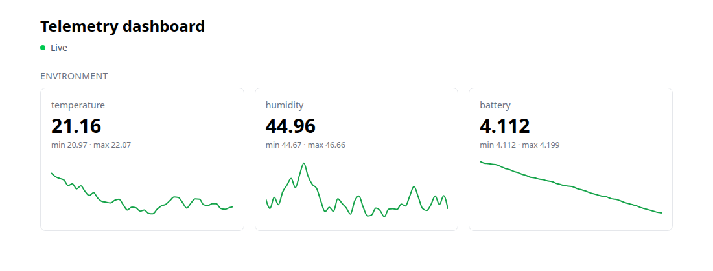
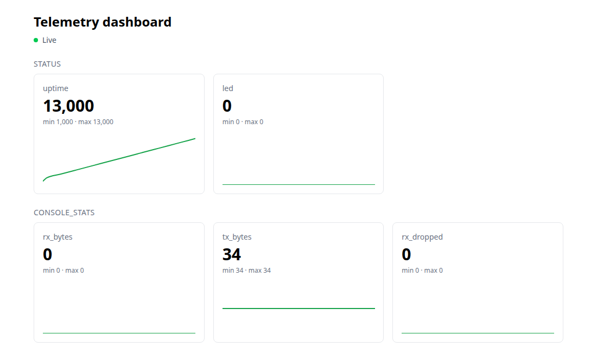

# telemetry-dashboard

[](https://github.com/Tonyc310/telemetry-dashboard/actions/workflows/ci.yml)

Live dashboard for device telemetry, built with Next.js and TypeScript. The server streams readings to the browser over Server-Sent Events, and the page shows each field's latest value, its range over the last five minutes, and a chart of its history.

It reads [serial-decoder](https://github.com/Tonyc310/serial-decoder)'s JSON Lines, which completes a chain with the other repos: [stm32-uart-driver](https://github.com/Tonyc310/stm32-uart-driver) firmware → serial-decoder → this dashboard. With no device connected, a built-in simulator stands in for one.



## Features

- Charts whatever messages and fields arrive; nothing is tied to one device
- Rolling five-minute window with the latest, minimum, and maximum of each field
- Every event is validated with Zod; invalid ones are counted and ignored
- Connection status with automatic reconnect, and a heartbeat that keeps quiet streams open
- Seedable simulator (temperature, humidity, battery) for running without hardware
- Real telemetry from any command that prints serial-decoder's JSON Lines

## Requirements

Node.js 20.9+ (CI uses Node 24).

## Run

```bash
npm install
npm run build && npm start    # http://localhost:3000
```

## Real telemetry

Set `TELEMETRY_COMMAND` to a command that prints serial-decoder's JSON Lines. It runs once while anyone has the page open, is stopped when the last viewer leaves (freeing the serial port), and is retried every second if it exits, for example while the device is still starting.

To watch the stm32-uart-driver firmware running in Renode, with serial-decoder installed:

```bash
# In stm32-uart-driver: run the firmware with its telemetry UART on TCP port 3456
renode -e 'include @tests/sim/stm32f4.resc; emulation CreateServerSocketTerminal 3456 "telemetry" false; connector Connect sysbus.usart3 telemetry; start'

# In this repo: decode it and stream it to the dashboard
TELEMETRY_COMMAND="serial-decoder --schema path/to/telemetry.toml --json --port socket://localhost:3456" npm start
```

The firmware's `status` and `console_stats` messages then appear without any change to the dashboard:



## Test

```bash
npm test
npm run lint && npm run type-check && npm run format:check
```

## Layout

```
app/          page, layout, and the /api/telemetry event stream
components/   dashboard, stat tiles, charts, connection status
lib/          reading schema, simulator, rolling window, command source
tests/        Vitest unit tests
docs/         screenshots
```

## License

MIT
